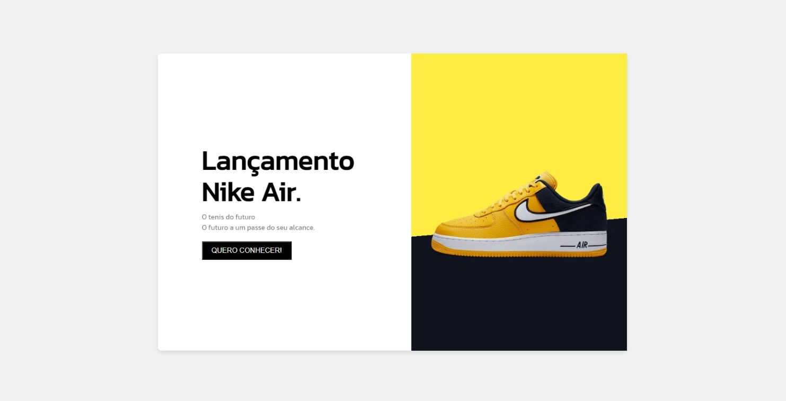

# Sobre o projeto

https://howisrian.github.io/pagina-tenis/

Projeto construido com o intuito de treinar minhas habilidades, layout obtido no desafio do [DevMentor](https://www.devmentor.com.br/challenge/landing-page-tenis-nike)

## Layout web

### Inicio

# Tecnologias utilizadas
- HTML
- CSS

# Autor

Rian Carlo Santana dos Santos

- Github: [@howisrian](https://www.github.com/howisrian)
- Linkedin: [Rian Santos](https://www.linkedin.com/in/santos-rian/)
